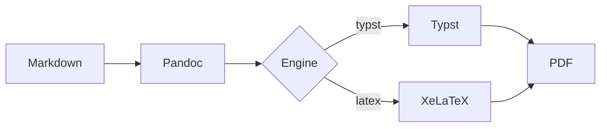

# Introduction

This is a comprehensive test document for **print_md**, demonstrating all supported
Markdown features. It includes _italic text_, **bold text**, ~~strikethrough~~, and
`inline code` formatting.

## Text Features

Here is a paragraph with a footnote[^1]. And another one[^2].

[^1]: This is the first footnote with some detailed explanation.
[^2]: And a second footnote for good measure.

### Links and Images

Visit [the Pandoc website](https://pandoc.org) for more information.

### Blockquotes

> "The purpose of computing is insight, not numbers."
>
> — Richard Hamming

## Code Blocks

### Python

```python
def fibonacci(n: int) -> list[int]:
    """Generate the first n Fibonacci numbers."""
    if n <= 0:
        return []
    fib = [0, 1]
    for i in range(2, n):
        fib.append(fib[i-1] + fib[i-2])
    return fib[:n]

# Print the first 10 Fibonacci numbers
for num in fibonacci(10):
    print(num, end=" ")
```

### Rust

```rust
fn main() {
    let numbers: Vec<i32> = (1..=10).collect();
    let sum: i32 = numbers.iter().sum();
    println!("Sum of 1 to 10: {}", sum);
}
```

### Shell

```bash
#!/bin/bash
echo "Hello from print_md!"
find . -name "*.md" -exec wc -l {} +
```

## Tables

| Feature         | Status | Notes                  |
|:----------------|:------:|:-----------------------|
| Tables          |   ✓    | Pipe tables supported  |
| Code blocks     |   ✓    | Syntax highlighting    |
| Math            |   ✓    | LaTeX via Typst        |
| Task lists      |   ✓    | GFM checkboxes         |
| Footnotes       |   ✓    | Bottom of page         |
| Strikethrough   |   ✓    | GFM extension          |

## Mathematics

Inline math: The quadratic formula is $x = \frac{-b \pm \sqrt{b^2 - 4ac}}{2a}$.

Display math:

$$
\int_{-\infty}^{\infty} e^{-x^2} dx = \sqrt{\pi}
$$

Euler's identity: $e^{i\pi} + 1 = 0$

## Task Lists

- [x] Set up project structure
- [x] Implement CLI with Click
- [x] Create Typst templates
- [ ] Add LaTeX engine support
- [ ] Write comprehensive tests

## Lists

### Unordered

- First item
  - Nested item A
  - Nested item B
- Second item
- Third item

### Ordered

1. First step
2. Second step
   1. Sub-step A
   2. Sub-step B
3. Third step

### Definition Lists

Term 1
:   Definition for term 1.

Term 2
:   Definition for term 2, with more detail.

## Mermaid Diagram



## Horizontal Rule

---

## Emoji

This works great :thumbsup: and is fast :rocket:

## Superscript and Subscript

Water is H~2~O. Einstein showed E = mc^2^.

---

*End of sample document.*
